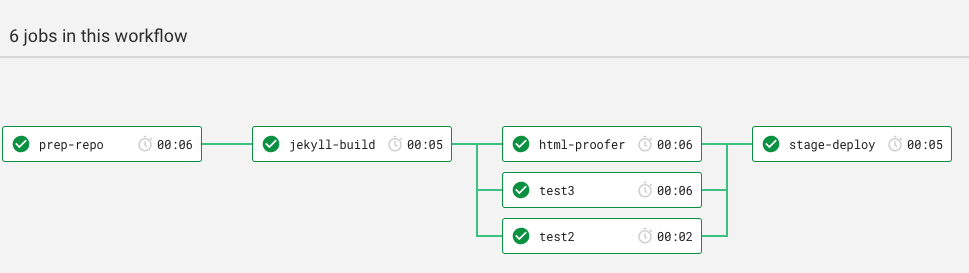
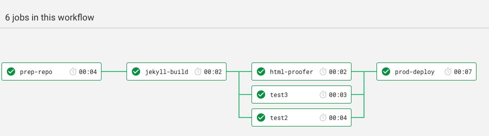

# The JAM stack - GitHub - Proflow

The two files in this repo belong together.

* Create a `.circleci` folder in the root of your repo
* Copy both `config.yml` and `play-proflow-cci-gh.yml` to the folder

The workflow supports 4 different flows:

1. A dev branch
2. A `ready/*` branch (created using the Phlow)
3. The `master` branch
4. Annotated tags

It's designed to run for a JAM stack - using GitHub as host for `origin` and GitHub Pages. In a JAM stack the final output of the build process is a static web site - in out flow it's deployed to GitHub Pages - but you can easily alter it to what ever you like - the four different flows are conceptual, they should work for any development setup.

The _play book_  `play-proflow-cci-gh.yml` represents a configuration approach to running shell scripts. I've added a elaborated discussion on the `play` script in [the end of this doc](#a-few-comments-on-the-play-book).


# A development branch - the basis flow
The flow allows you to push _any_ branch you desire and that way use the Circlel CI setup at a _build farm_. It will not deliver or deploy anything, it will just run your _Definition of Done_.

˛

The fist step `prep-repo` simply prepares the repo - the step does not have an important function in this flow, except that it creates a cache, so in the following steps we'll save time by reusing the Circle CI cache, rather than pulling it from GitHub in every step.

The second step `jekyll-build` builds the static web site and then saves it in another Circle CI cache - containing only the derived objects form the build process.

The test are there to show, that at this point it's possible to run tests in parallel - they all operate on the static site data - end not the actual git repo.

And that's really it - in this flow.

# A ready-branch

When a branch arrive that has the prefix `ready/` it triggers the flow to integrate it in to the target branch - most often `master`.


It's essentially the same flow as the basis flow above, but with two differences. In the `prep-repo` the ready branch is merged into the target branch `master` and when the verification is done, it triggers a final step `deliver` which pushes master back to GitHub. Ideally you should then put a [restriction on the target integration branch](https://help.github.com/en/articles/enabling-branch-restrictions) (probably `master`), So that only the _release_ user running the Circle CI flow can push to it.

# The master branch

The master branch flow is really the same as the basis flow, only exception is that on successful execution it' ends with a deploy to the stage environment.

.

It simply pushes the static site data to a dedicated GitHub repo, which is setup to be served by GitHub Pages.

# Annotated SemVer tags

The flow is identical to the one for the master branch, except the final step pushes to a different target and it's triggered by a tag that complies to the [_semantic versioning_](http://www.semver.org), but only if the tag is annotated.



``` bash
git tag 1.0.1
git tag -m "Release feature xyz" 1.0.2
git push --tags
```

The three commands above vill trigger two builds of the flow, one for tag `1.0.1` and one for tag `1.0.2` but the first one will fail, because it's not an annotated tag.

A tag that isn't annotated is essentially just a pointer to an existing commit, while an annotated tag is a first-class citizen in git, with it's own integrity.

# A few comments on the play book

The deliver step that wraps up the flow when triggered by `master` serves as a fine example, as it's really short.

In the `.circleci/config.yml` file you have:

```yaml
deliver:
  working_directory: /app
  docker:
    - image: lakruzz/play:latest
  steps:
    - restore_cache:
        keys:
          - the-repo-{{ .Revision }}
    - run:
        name: Deliver
        command: play --manuscript .circleci/play-proflow-cci-gh.yml --part deliver
```

This makes it nice and easy to read in the `config.yml` the `.circleci/play-proflow-cci-gh.yml` is designed like a "play" performed at a "theater" it's also laid out as nice readable yaml, and defines different "props" (environment variables) end the "scene"  which can be more or less verbose and then then the "parts" which all have "lines" to perform.

Let's look at the `--deliver` part in the  `.circleci/play-proflow-cci-gh.yml` invoked from the `config.yml` above:

```yaml
manuscript:
#  ...
  parts:
#    ...
    deliver:
      props:
        - PLAY_REPOSITORY: '`printenv CIRCLE_REPOSITORY_URL | sed  s/".*github.com[\/:]//" | sed s/.git//`'
      scene:
        dryrun:  no
        verbose: yes
        debug:   no
      lines:
        - run:
            caption: Add a remote that has permissions to write
            command: git remote add integrated https://$PHLOW_GHTOKEN@github.com/$PLAY_REPOSITORY.git
            die_on_err: yes
        - run:
            caption: Push current branch to GitHub
            command: git push integrated
            die_on_err: yes
        - run:
            caption: Delete the remote triggering branch
            command: git push integrated :$CIRCLE_BRANCH
            die_on_err: yes
```

It's obvious that this part is supposed to run in Circle CI context, as it assumes the existence of both `$CIRCLE_REPOSITORY_URL`and `$CIRCLE_BRANCH`. The props are just a nickname for the environment variables to set. The values however can be executable strings. The deliver part also mentions the environment variable `$PHLOW_GHTOKEN`. This is a GitHub Developer [personal access token](https://github.com/settings/tokens) which is stored in the environment variable set in the Circle CI settings.
