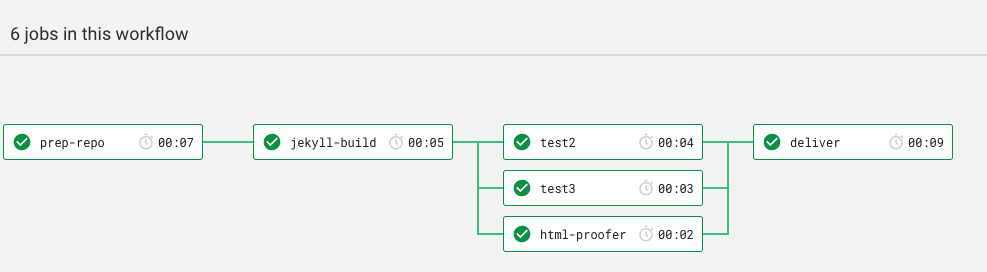

# The Jekyll - GitHub - Proflow

The two files in this repo belong together.

* Create a `.circleci` folder in the root of your repo
* Copy both `config.yml` and `play-proflow-cci-gh.yml` to the folder

The workflow supports 4 different flows:

1. A dev branch
2. A `ready/*` branch (created using the Phlow)
3. The `master` branch
4. Annotated tags

# A development branch
The flow allows you to push _any_ branch you desire and that way use the Circlel CI setup at a _build farm_. It will not deliver or deploy anything, it will just run your _Definition of Done_.

˛

The fist step `prep-repo` simply prepares the repo - the step does not have an important function in this flow, except that it creates a cache, so in the following steps we'll save time by reusing the Circle CI cache, rather than pulling it from GitHub in every step.

The second step `jekyll-build` builds the static web site and then saves it in another Circle CI cache - containing only the derived objects form the build process.

The test are there to show, that at this point it's possible to run tests in parallel - they all operate on the static site data - end not the actual git repo.

And that's really it - in this flow.

# A ready-branch

When a branch arrive that has the prefix `ready/` it triggers the flow to integrate it in to the target branch - most often `master.

It's essentially the same flow, 
